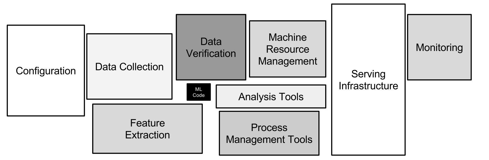

I've been using Argo at work to create a machine learning pipeline
that goes through all the steps to train a model from start to finish
in a fully automated fashion. This has been an incredible learning 
experience for me as a data scientist / ML engineer, so I thought I spend
my Saturday afternoon with a coffee and spewing my thoughts, successes
and failures in using this approach. 

## What is Argo anyway?


According to the documentation, [Argo](https://argoproj.github.io/) is a

>Container native workflow engine for Kubernetes supporting both DAG and step based workflows

As a practitioner of Data Science, it's likely that you've heard of containers and kubernetes, 
but maybe you've never used these tools before. Maybe you're an expert at these things, but aren't sure
why a data scientist would care. Let me try to rephrase
the selling point of Argo in a way that matters to a machine learning practitioner

>Argo automates away the stuff you don't care about as a Data Scientist, such as infrastucture stability, while giving you the flexibility to do what you want and the scaling to handle large amounts of data and compute.

The promise that Argo and kubernetes bring to the table is not just a jumble of buzzwords, but rather
that **you can eliminate undifferentiated labor from your workflow** and this allows you to
**focus on the stuff that you care about, such as data, feature engineering, and algorithms**

## What Problems does this solve?


[Hidden technical debt in machine learning systems](https://papers.nips.cc/paper/5656-hidden-technical-debt-in-machine-learning-systems.pdf)

>Only a small fraction of real-world ML systems is composed of the ML code, as shown by the small black box in the middle. The required surrounding infrastructure is vast and complex.

If you're just starting out in data science you might not've come across the problems that Argo is addressing, 
but sooner or later, it'll come up. The fact of the matter is, that a majority of the work that goes into
a machine learning system has almost nothing to do with machine learning itself. The toolset available
to the modern data scientist includes incredibly advanced libraries like Tensorflow, SpaCy, H2O, XGboost, PyTorch and
PyMC3, just to name a few. These libraries make it easier than ever before to write code that takes some prepared data
and creates a model from it. Thus the act of **creating a single machine learning model** is relatively simple. The challenge
often comes from all the other crap you have to do to get this stuff working.

- Getting a computer with enough resources (RAM, CPU) to run your code
- Finding the right libraries, installing all of them and their dependencies on the computer
- Configuring access to the data, setting up credentials and proxy configurations
- Writing code to do your data transformations
- Choosing a ML Algorithm
- Realize this algorithm requires a completely new software stack, and now you need a GPU to run Tensorflow
- Buying and installing a GPU, nividia drivers, CUDA and tensorflow
- Writing training code and training a new model
- Saving the model, testing it on some test data
- Either:
    - Writing an API server to host the model in production (rarer than you might think)
    - Manually run your model in batch mode on new data, or maybe using a Cron scheduler
- WHOOPS! Now you acquired the biggest customer ever, and you're data just increased 10x. Redo everything with spark
- Buy a cluster
- Hire a cluster admin
- Install HDFS and spark on cluster
- Wait what was I even doing???

As you can see, the act of training a model on a single CPU is really only a small fraction
of the work that goes into creating a **sustainable machine learning** ***system***. I think most of the
time we fall into the trap of thinking that modeling is the part of the job that we do to provide
value to the company, but a machine learning model is mostly useless if it isn't being 
used to make decisions on new data (there are exceptions to this rule). As Machine Learning 
practitioners, we provide value because we can **automate the decision making process such that
it can scale to superhuman speed, scale and/or accuracy**. 

In order to do this well, we need to make the process of generating new models 
as seamless as possible, so we can learn from our current model and improve it.

## How Does Argo help us?

DevOps is a huge buzzword in the industry, but for a good reason. The trend in the
industry is going away from long, heavy releases and towards shorter but more rapid
cycles of iteration. The idea is that you learn more from working on the problem, so
you don't have to predict way ahead of time what it is that your product needs to do. 
It's effectively the scientific method applied to software development 
(you software engineers thought it was your idea? :^) ). Well there's a lot of buzz
in the industry now of applying these same DevOps technique to Machine Learning systems. With 
the explosion of cloud computing, and open source orchestrators like Kubernetes, it is now
possible to automate the following:

- Getting a computer with enough resources (RAM, CPU) to run your code
- Installing all libraries and their dependencies on the computer
- Configuring access to the data, setting up credentials and proxy configurations
- Buying and installing a GPU, nividia drivers, CUDA and tensorflow
- Training a new model
- Saving the model, testing it on some test data
- Buy a cluster
- Install HDFS and spark on cluster
- Creating a model prediction server with autoscaling to meet demand

Automating these steps is what Kubernes and Argo do for you. Let's take a look 
at an Argo workflow specification:

```yaml
apiVersion: argoproj.io/v1alpha1
kind: Workflow
metadata:
  generateName: my-model-pipeline-
spec:
  entrypoint: train-sklearn-model
  templates:
  - name: train-sklearn-model
    container:
      image: continuumio/anaconda
      command: [python]
      args: ["train.py"]
    resources:
      requests:
        memory: "32Gi"
        cpu: 12  
```

There's some extra boilerplate in here that won't make sense right away, but look at the stuff
in the templates section. This is an argo workflow that will provision a machine with 12 CPUs and
32GiB of RAM. It will then use docker to pull down anaconda python distribution. Then it will
run the `python` command on the file `train.py` (in practice, you would have to make an image
with that file in it somewhere). In order to run the workflow, simply `argo submit workflow.yaml` 
to your kubernetes cluster (and setting up a cluster is getting easier by the day with google GKE and amazon EKS).
But we all know that "data munging" (can we please kill this phrase?) is often a majority
of the work in producing a new model, so let's add in some steps for that:

```yaml
apiVersion: argoproj.io/v1alpha1
kind: Workflow
metadata:
  generateName: my-model-pipeline-
spec:
  entrypoint: workflow
  templates:
  - name: workflow
    dag:
      tasks:
      - name: transform-data
        template: transform-data-template
      - name: train-model
        dependencies: [transform-data]
        template: train-template

  - name: transform-data-template
    container:
      image: gettyimages/spark
      command: [pyspark]
      args: ["transform.py"]
      resources:
        requests:
          memory: "64Gi"
          cpu: 32

  - name: train-template
    container:
      image: continuumio/anaconda
      command: [python]
      args: ["train.py"]
      resources:
        requests:
          memory: "32Gi"
          cpu: 12   
```

Here we've simply extracted our training templates and our transform
data templates out. Then we define a Directed Acyclic Graph (DAG) of
our tasks. The training step depends on the transformation step, so
it will only run if the transform step succeeds first. But looking at the
templates begins to really show the the strength of this approach. Let's 
say we already had our train step working the way we wanted it do, but
now we need to change our transform step, maybe to use spark on a bigger
dataset. Well we can completely change the
entire tech stack of the transform step, **completeley independently of the
model training step.** If we wanted to, we could even have the data transform step **provision and use an entire spark cluster, and spin it down when it's done**. It's obviously more complicated to do something like this, 
but I do it at work all the time (interested parties can see the [Spark Operator](https://github.com/GoogleCloudPlatform/spark-on-k8s-operator)).

Oh but we're not done at all! Where does this data even come from?

```yaml

apiVersion: argoproj.io/v1alpha1
kind: Workflow
metadata:
  generateName: my-model-pipeline-
spec:
  entrypoint: workflow
  templates:
  - name: workflow
    dag:
      tasks:
      - name: pull-data
        template: get-data-from-postgres
      - name: transform-data
        dependencies: [pull-data]
        template: transform-data-template
      - name: train-model
        dependencies: [transform-data]
        template: train-template

  - name: get-data-from-postgres
    container:
      image: continuumio/anaconda
      command: [python]
      args: ["extract-data-from-database.py"]
      env:
        - name: DATABASE_USER
          valueFrom:
            secretKeyRef:
              name: my-database-credentials
              key: user
        - name: DATABASE_PASSWORD
          valueFrom:
            secretKeyRef:
              name: my-database-credentials
              key: password
```

The data probably comes from a database, or an object store like AWS s3.
In order to access it, you will need some credentials. Well
what you can do with Argo is setup the template so that it'll grab the credentials from kubernetes and set the environment variables, so your script
can look them up and use them. This way your code won't ever have credentials
in it. And what happens if your company is going through a cloud migration?
Maybe your data source changes from a database to a data lake architecture, what then? The great thing is now you only have to manage that change in the
`pull-data` step, and the entirety of the pipeline can be re run afterwards. 

## Wrapping It Up

Well this is taking a bit longer than I initially expected, but at this point I hope I've been able to illustrate that using Argo to 
create a machine learning pipeline offers a significant amount of 
decoupling to all aspects of your machine learning code. It allows
you the freedom to **use the best software stack for the particular job
at hand**. Also at this point you're probably realizing the irony of my
blog post: we've spend all this time and haven't talked one lick of ML!


But I'd argue that this is ok. The great thing about using the tools 
from the DevOps part of the world is, you only have to write this stuff 
once. So while there is some overhead in specifying it the first time around,
when you inevitably have to run this stuff again, you simply `argo submit` 
and you're done. Even when your laptop dies. Even when you change from 
on premises to the cloud.

The next time I'm feeling motivated, we can discuss what happens after
the model training event. I'd also feel remiss not to mention 
[Kubeflow](https://www.kubeflow.org/) as an exciting development that
uses Argo as an execution layer for ML workflows. 
