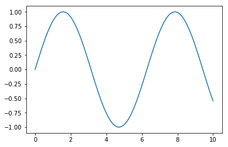
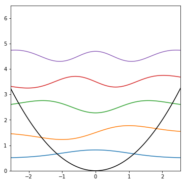
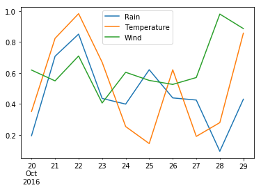
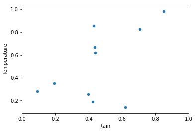
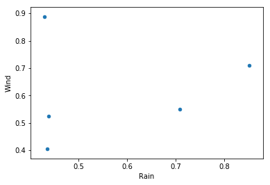
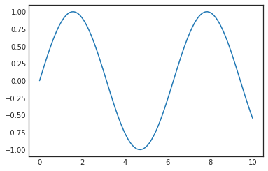
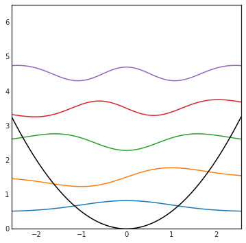
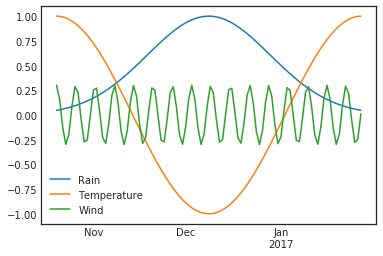
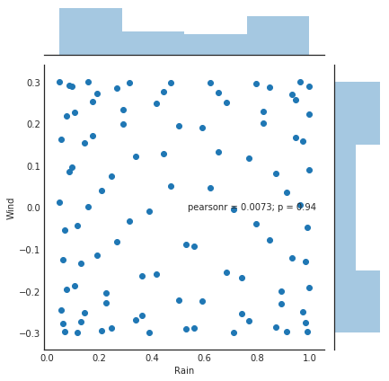
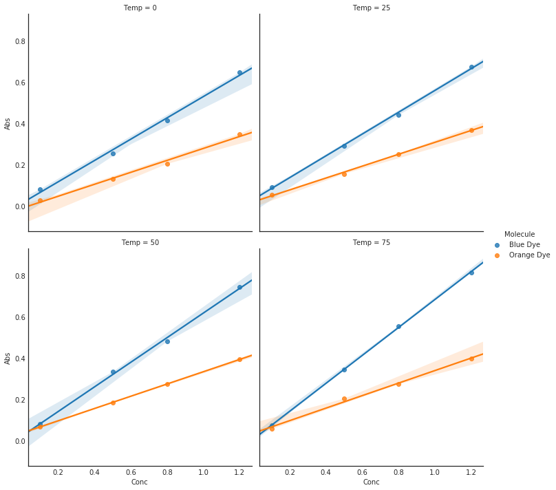

## Getting Started
---

This presentation is no help if you can't get the python packages it uses! There are a few options here. If you're not already set up, probably the easiest way to install python packages is [pip](https://pip.pypa.io/en/stable/). If you don't already have it, here are [installation instructions](https://packaging.python.org/installing/#install-pip-setuptools-and-wheel). I'm a big fan of the [anaconda](https://www.continuum.io/) python distrubution, which comes pre-loaded with basically everything I'm using today. Just use whatever works for you. 

For example, installing numpy is easy, in a command line:

pip install numpy

If you're using anaconda, you can also use their package manager:

conda install numpy

Pip is probably the preferred method, even when you're using anaconda. The packages I'm discussing today are [numpy](http://www.numpy.org/), [scipy](https://www.scipy.org/), [pandas](http://pandas.pydata.org/), [matplotlib](http://matplotlib.org/), [seaborn](https://seaborn.github.io/). 

Other useful tools are [Numba](http://numba.pydata.org/) and [Cython](http://cython.org/). As far as I know, all of these are in both package managers. 

I've recently been told that pandas depends on cython and seaborn depends on pandas. 

You should therefore install cython -> pandas -> seaborn in that order. 

This talk was made using a [jupyter](http://jupyter.org/) notebook. 

## Python is slow! Why bother?
---

This is a common reason people want to avoid python, and it's half true. See for example this function that performs a matrix multiplication:


```python
import math
N = 300

mat1 = [[1.5*i + j for i in range(N)] for j in range(N)]
mat2 = [[2.5*i + j for i in range(N)] for j in range(N)]

def mmult(mat1, mat2):
    mat3 = [[0.0 for i in range(N)] for j in range(N)]
    
    for i in range(N):     
        for k in range(N):  
            for j in range(N):  
                mat3[i][k] += mat1[i][j] * mat2[j][k]
    return mat3

%time m3 = mmult(mat1, mat2)
```

    CPU times: user 3.78 s, sys: 0 ns, total: 3.78 s
    Wall time: 3.78 s
    

Well that doesn't seem so bad! This would take longer to do by hand! It actually is pretty slow.  [Here's](https://jakevdp.github.io/blog/2014/05/09/why-python-is-slow/)
a look at some of the reasons why. It has to do with the fact that python is dynamically typed and interpreted, rather than compiled. Additionally, the arrays in native python aren't laid out in one chunk of memory.


## It doesn't have to be this way! (Numpy section)
---

If you're going to be doing serious numerical work in python, numpy is essential. If you're doing a lot of work with arrays, the performance difference between raw python and C/C++/Fortran can easily be several orders of magnitude. Numpy is focused on fast, efficient manipulation of arrays. They can be any size, any dimension as long as your computer can store it. Numpy methods are compiled and very efficient (comparable to compiled code). Let's take a look at our matrix multiply again:


```python
import numpy as np # convention

npmat1 = np.asarray(mat1) # use numpy arrays, they are contiguous in memory
npmat2 = np.asarray(mat2)

%time npmat3 = np.dot(npmat1, npmat2) # dot is used for dot product or matrix multiply
```

    CPU times: user 4 ms, sys: 4 ms, total: 8 ms
    Wall time: 5.86 ms
    

WHOA! Blazing fast! Morale of the story: if there is a numpy function to do it, use it! And there  is a numpy function for a lot of stuff, here's a few useful ones:

[np.linalg.eig](http://docs.scipy.org/doc/numpy-1.10.0/reference/generated/numpy.linalg.eig.html) - eigenvectors/values 

[np.zeros](http://docs.scipy.org/doc/numpy/reference/generated/numpy.zeros.html) - create an array of zeros

[np.linspace](http://docs.scipy.org/doc/numpy/reference/generated/numpy.linspace.html) - create an array of values spaced linearly between 2 endpoints

[np.sort](http://docs.scipy.org/doc/numpy-1.10.1/reference/generated/numpy.sort.html) - Sort an array

[np.amax](http://docs.scipy.org/doc/numpy/reference/generated/numpy.amax.html) - Return maximum value of array

[np.random.rand](http://docs.scipy.org/doc/numpy/reference/generated/numpy.random.rand.html) - create array of random values in [0, 1)

There's about 3 trillion more ... 

## A few useful tips about numpy arrays:
---
### 1) Most 'normal' operations are element-wise:


```python
A = np.array([[1, 2, 3]
             ,[4, 5, 6]
             ,[7, 8, 9]])
print(10 + A)
```

    [[11 12 13]
     [14 15 16]
     [17 18 19]]
    


```python
print(2 * A)
```

    [[ 2  4  6]
     [ 8 10 12]
     [14 16 18]]
    


```python
print(A == 5)
```

    [[False False False]
     [False  True False]
     [False False False]]
    


```python
B = np.array([[10, 20, 30]
             ,[40, 50, 60]
             ,[70, 80, 90]])
print(A + B)
```

    [[11 22 33]
     [44 55 66]
     [77 88 99]]
    

### 2) You can 'slice' numpy arrays


```python
print(A, '\n')
print(A[:, 2])  # 3rd column (starts at 0)
```

    [[1 2 3]
     [4 5 6]
     [7 8 9]] 
    
    [3 6 9]
    


```python
print(A[1, :])  #Second row
```

    [4 5 6]
    


```python
print(A[0:2, 0:2]) # Top-Left 2x2 section
```

    [[1 2]
     [4 5]]
    

### 3) You can index a numpy array... with a numpy array


```python
indices = np.array([0, 2])
print(A)
```

    [[1 2 3]
     [4 5 6]
     [7 8 9]]
    


```python
print(A[indices])  # first and third row
```

    [[1 2 3]
     [7 8 9]]
    


```python
print(A[:,indices])  # first and third column
```

    [[1 3]
     [4 6]
     [7 9]]
    


```python
indices2 = np.asarray([[True, True, False]
                     ,[False, True, True]
                     ,[False, False, False]])
print(A, '\n')
print(A[indices2])  # All elements where indices2 is True
```

    [[1 2 3]
     [4 5 6]
     [7 8 9]] 
    
    [1 2 5 6]
    

### 4) And you can combine operations


```python
symmetric = np.array([[1, 4, 4]
                     ,[4, 1, 4]
                     ,[4, 4, 1]])

asymmetric = np.array([[1, 4, 4]
                      ,[7, 1, 4]
                      ,[42, 5, 1]])
```

Maybe to check if a matrix is symmetric


```python
np.all(symmetric.T == symmetric)
```


    True


```python
np.all(asymmetric.T == asymmetric)  # WARNING if using floats, compare
                                    # with np.isclose(x.T, x)
```


    False


Or to sort eigenvales and eigenvectors so that the eigenvalues are in ascending order, and you keep track of the vectors!


```python
vals, vecs = np.linalg.eig(symmetric)
print(vals)
print(vecs)
print('\n')

indices_of_sorted_vals = np.argsort(vals)
print(vals[indices_of_sorted_vals])     
print(vecs[:, indices_of_sorted_vals])  # columns are rearranged
```

    [-3.  9. -3.]
    [[-0.81649658  0.57735027  0.19219669]
     [ 0.40824829  0.57735027 -0.7833358 ]
     [ 0.40824829  0.57735027  0.59113912]]
    
    
    [-3. -3.  9.]
    [[-0.81649658  0.19219669  0.57735027]
     [ 0.40824829 -0.7833358   0.57735027]
     [ 0.40824829  0.59113912  0.57735027]]
    

## Scipy
---

We're all scientists here, so It would be silly to avoid scipy. It's a library of scientifically relevant tools. Here's a list of some of the submodules:

Special functions (scipy.special)

Integration (scipy.integrate)

Optimization (scipy.optimize)

Interpolation (scipy.interpolate)

Fourier Transforms (scipy.fftpack)

Signal Processing (scipy.signal)

Linear Algebra (scipy.linalg)

Sparse Eigenvalue Problems with ARPACK

Compressed Sparse Graph Routines (scipy.sparse.csgraph)

Spatial data structures and algorithms (scipy.spatial)

Statistics (scipy.stats)

Multidimensional image processing (scipy.ndimage)

File IO (scipy.io)

Weave (scipy.weave)

The various python modules make it super easy to do lots of things, like making a function that returns the nth harmonic oscillator wavefunction:


```python
from math import factorial, pi
from scipy.special import hermite as h

def psi(x, n):
    N = 1.0 / np.sqrt(float(2**n) * factorial(n)) * (1.0 / pi)
    return N * np.exp(-x*x / 2.0) * h(n)(x)
```

If I try to cover all of scipy it will get boring fast... you can look up functions as you need them

## Matplotlib
---

Matplotlib is the tool to go to for quick plotting stuff in Python. It can handle 2D, 3D, and even animations. 


```python
import matplotlib.pyplot as plt
# Jupyter  "Magic", just so you see the images in the notebook
%matplotlib inline 

fig = plt.figure(figsize=(6,4))

x = np.linspace(0, 10, 100)   # list of x from 0 to 10 by 100 steps
y = np.sin(x)                 # take the sign of each element in x
plt.plot(x, y)                # do I have to explain this one?
plt.show()
```





To plot multiple things at once, call plt.plot() more than once


```python
def plot_HO(N): # plot N wavefunctions
    fig = plt.figure(figsize=(6,6))


    ymax = N + 1.5
    xmax = math.sqrt(ymax)    # figuring out plot ranges
    x = np.linspace(-xmax, xmax, 100)

    for n in range(N):                       # from n = [0...N)
        plt.plot(x, psi(x, n) + (n + 0.5))   # Plot the wavefunction offset by
                                             # energy

    plt.plot(x, 0.5 * x*x, 'k')  # Plot the potential

    plt.xlim(-xmax, xmax)
    plt.ylim(0, ymax)
    plt.show()
plot_HO(5)
```





Matplotlib has functions for scatterplots, pie charts, bar graphs, heatmaps blah blah blah...

## Pandas
---

I recently started using Pandas in my research, and It's already proven incredibly useful for data analysis. The library is focused on the Series and the DataFrame. 


```python
import pandas as pd

series1 = pd.Series([4, 2.5, 8, 72])
series1
```


    0     4.0
    1     2.5
    2     8.0
    3    72.0
    dtype: float64


I don't know about you, but this isn't the most impressive thing to me... just hold on. 

Here's an example of a DataFrame, the reason I'm in love with this library


```python
Cols = ['Rain', 'Temperature', 'Wind']
Dates = pd.date_range('20161020', periods=10)
data = np.random.rand(10, 3) # 3 cols 10 rows

df= pd.DataFrame(data, index=Dates, columns=Cols)
df
```


<div>
<style scoped>
    .dataframe tbody tr th:only-of-type {
        vertical-align: middle;
    }

    .dataframe tbody tr th {
        vertical-align: top;
    }

    .dataframe thead th {
        text-align: right;
    }
</style>
<table border="1" class="dataframe">
  <thead>
    <tr style="text-align: right;">
      <th></th>
      <th>Rain</th>
      <th>Temperature</th>
      <th>Wind</th>
    </tr>
  </thead>
  <tbody>
    <tr>
      <th>2016-10-20</th>
      <td>0.193955</td>
      <td>0.350702</td>
      <td>0.618494</td>
    </tr>
    <tr>
      <th>2016-10-21</th>
      <td>0.707791</td>
      <td>0.823698</td>
      <td>0.548552</td>
    </tr>
    <tr>
      <th>2016-10-22</th>
      <td>0.851024</td>
      <td>0.983293</td>
      <td>0.709565</td>
    </tr>
    <tr>
      <th>2016-10-23</th>
      <td>0.434959</td>
      <td>0.669047</td>
      <td>0.405353</td>
    </tr>
    <tr>
      <th>2016-10-24</th>
      <td>0.398242</td>
      <td>0.252898</td>
      <td>0.604027</td>
    </tr>
    <tr>
      <th>2016-10-25</th>
      <td>0.620698</td>
      <td>0.142928</td>
      <td>0.551496</td>
    </tr>
    <tr>
      <th>2016-10-26</th>
      <td>0.438231</td>
      <td>0.620494</td>
      <td>0.525627</td>
    </tr>
    <tr>
      <th>2016-10-27</th>
      <td>0.424516</td>
      <td>0.189178</td>
      <td>0.570212</td>
    </tr>
    <tr>
      <th>2016-10-28</th>
      <td>0.093206</td>
      <td>0.278414</td>
      <td>0.980758</td>
    </tr>
    <tr>
      <th>2016-10-29</th>
      <td>0.429858</td>
      <td>0.857150</td>
      <td>0.886912</td>
    </tr>
  </tbody>
</table>
</div>


```python
df['Rain']  # Grab all the stuff in 'Rain' column
```


    2016-10-20    0.193955
    2016-10-21    0.707791
    2016-10-22    0.851024
    2016-10-23    0.434959
    2016-10-24    0.398242
    2016-10-25    0.620698
    2016-10-26    0.438231
    2016-10-27    0.424516
    2016-10-28    0.093206
    2016-10-29    0.429858
    Freq: D, Name: Rain, dtype: float64


```python
df.loc['2016-10-23']  # locate this date
```


    Rain           0.434959
    Temperature    0.669047
    Wind           0.405353
    Name: 2016-10-23 00:00:00, dtype: float64


```python
df.iloc[2]  # grab the 3rd row
```


    Rain           0.851024
    Temperature    0.983293
    Wind           0.709565
    Name: 2016-10-22 00:00:00, dtype: float64


```python
df.plot()  # Plot all the stuff
```


    <matplotlib.axes._subplots.AxesSubplot at 0x7f67de0d2e80>





```python
df.plot.scatter(x='Rain', y='Temperature')
plt.xlim(0,1)
plt.show()
```





You can find data by name and apply an operation to it, like checking which days had small amounts of rain:


```python
df['Rain'] < 0.1
```


    2016-10-20    False
    2016-10-21    False
    2016-10-22    False
    2016-10-23    False
    2016-10-24    False
    2016-10-25    False
    2016-10-26    False
    2016-10-27    False
    2016-10-28     True
    2016-10-29    False
    Freq: D, Name: Rain, dtype: bool


Hmm, that's pretty nice isn't it? What if we could easily select only the parts that satisfy our condition? ....


```python
df[df['Rain'] < 0.1]
```


<div>
<style scoped>
    .dataframe tbody tr th:only-of-type {
        vertical-align: middle;
    }

    .dataframe tbody tr th {
        vertical-align: top;
    }

    .dataframe thead th {
        text-align: right;
    }
</style>
<table border="1" class="dataframe">
  <thead>
    <tr style="text-align: right;">
      <th></th>
      <th>Rain</th>
      <th>Temperature</th>
      <th>Wind</th>
    </tr>
  </thead>
  <tbody>
    <tr>
      <th>2016-10-28</th>
      <td>0.093206</td>
      <td>0.278414</td>
      <td>0.980758</td>
    </tr>
  </tbody>
</table>
</div>


Ok that's pretty neat. I think this alone is useful. But we're just getting started! 

What if we could find all parts of our data frame that satisfy a given condition, then plot two other columns of that data? Say no more...


```python
TempsAbove = df[df['Temperature'] > 0.5]
TempsAbove.plot.scatter('Rain', 'Wind')
plt.show()
```





The reason I like this library so much is that you can use the past few examples, combining them as you wish, and analyze huge amounts of data in seconds. Lately I've written a function to do a custom plot on each row of a dataframe (optionally you can apply a condition to a dataframe and pass that through). I take my output files, parse them and put them into a dataframe. This lets me go from a directory of output files to a ton of plots in seconds, with little effort. 

## Seaborn
---

*Update: As of matplotlib 2.0, the style defaults there are actually good. Seaborn is now less useful if you're not doing statistical plots. *

Let's face it: I've been to enough talks to know that most people don't know how to make visually appealing figures. Well the good news is that you don't have to. Trust in Seaborn, for it is magnificent. 


```python
import seaborn as sns # importing changes defaults
plt.ylim(-1.1, 1.1)
plt.plot(x, y)
```


    [<matplotlib.lines.Line2D at 0x7f67ddf5d3c8>]


This is the default with nothing done, the library was made to have nice colorschemes out of the box, but I prefer a less intrusive background


```python
sns.set_style('white')
plt.ylim(-1.1, 1.1)
plt.plot(x, y)
```


    [<matplotlib.lines.Line2D at 0x7f67dafe6cf8>]





Remember our harmonic oscillator plots?


```python
plot_HO(5)
```





There are a lot of built in plots, mostly for discrete data points and statistics. I mostly use the color palettes and things like that, but if you need to do statistical plots, look no further


```python
Cols = ['Rain', 'Temperature', 'Wind']
N = 100
Dates = pd.date_range('20161020', periods=N)

from scipy.signal import gaussian
rain = gaussian(N, 20)         
Temp = np.cos(np.linspace(0, 6.28, N))
Wind = np.cos(np.arange(N)) * 0.3
data = np.zeros((N,3))
data[:, 0] = rain
data[:, 1] = Temp
data[:, 2] = Wind

df2 = pd.DataFrame(data, index=Dates, columns=Cols)
df2.plot()
plt.ylim(-1.1, 1.1)
plt.show()
```





```python
sns.jointplot(x='Rain', y='Wind', data=df2)
```


    <seaborn.axisgrid.JointGrid at 0x7f67ddffb320>





```python
cols = ['Abs', 'Conc', 'Molecule', 'Temp']

Temps = [0, 25, 50, 75]
Molecules = ['Blue Dye', 'Orange Dye']
Absorptivity = [0.2, 0.1]   # whatever units makes this reasonable
Concs = [0.1, 0.5, 0.8, 1.2]

data = []
for temp in Temps:
    for j in range(len(Molecules)):
        for conc in Concs:
            A = Absorptivity[j] * conc * np.exp((273 + temp) / 300)
            A += np.random.rand() * 0.05
            data.append([A, conc, Molecules[j], temp])
       

AbsDF = pd.DataFrame(data, columns=cols)
fig = plt.figure(figsize=(5, 5))
sns.lmplot(x='Conc', y='Abs', hue='Molecule', 
           col='Temp', data=AbsDF, col_wrap=2)
plt.show()
```


    <matplotlib.figure.Figure at 0x7f67d947c198>





```python

```
