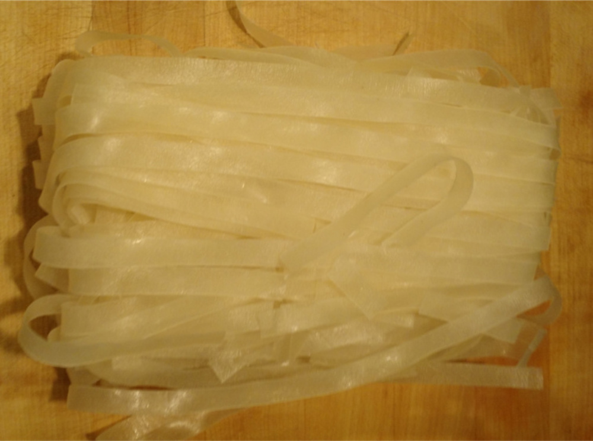

Winter is here! If the idea of a hot bowl of meatiness appeals to
you this time of year, then I have some good news for you. I just made
this recipe this afternoon, and I'm willing to put it out into the
open because there was no way that lots of meat in a pot wouldn't
turn out pretty well.

---

We start off by searing our meat in a pot with the sesame oil on
medium high heat. I want to emphasize that the choice of meat here is entirely
up to you. Just make sure whatever you get is relatively bony, and can hold up
to being cooked for hours. I've chosen half lamb neck and half pork neck
because that's what they had at the local Asian market. You could certainly use
the shin, neck, ankle, foot, of mostly any animal here.

Start by adding the sesame oil to a hot pot, and wait until you just start to
see smoke. Add your meat, making sure not to crowd the bottom (you may need
to do this in batches).

You just want to sear the meat on all sides until it's brown, roughly 3
minutes per side. While that's browning away, now would be a good time to peel
and chop your
garlic and your ginger. You're gonna want roughly equal amounts of each. The
size of the cuts is not super important, since this will basically dissolve
inside the soup anyway.

Additionally, you should have enough time to cut and clean the leeks. These
will also basically disappear inside the soup so again the size is a little
less important than normal. I went with halving the leeks lengthwise, then
cutting into penny-sized chunks.

While we're at it, I don't want to waste the top parts of the leek. The texture
of this part is kinda stringy, but it still has good flavor. I wrapped it up
in some butcher twine, like a monstrous bouquet. We'll use this later.

By now your meat should be seard. It should look something like this.

Once the meat is fully browned, remove it from the pot and set aside. Add the
chopped leeks into the pot and cook them down thoroughly. You want the leeks
to be soft, almost mushy, and you want a brown fond to develop on the bottom
of the pot. This probably took close to 20 minutes.

At this point you're gonna deglaze the pot with the shaoxing rice wine. If you
can't find this, look harder, and in an Asian market. It should only take a few
seconds to deglaze, at which point you should add the water into the pot, making
sure to cover all the meats. I also chose to add some pork knee bone that was
on the cheap at the store, to give even better flavor.

Remember that Leek bundle? I also threw it on top to extract a bit more flavor.
Bring the soup up to boil then cook for a bit.  

After about 20 minutes, the leeks were very soft, so I took them out and chopped
up the good bits to put back inside, and discarded the tough parts. This next
step is where the magic happens. Put a lid on the pot and bring to a boil if
needed. Turn down the heat and cook. for minimum 2 hours. Longer is probably
Here's the trick: *don't reduce to simmer*.

You keep the pot at a steady boil for the whole duration. This keeps the water
moving and I've been told (didn't bother to verify though) that this helps
extract the bones better. If you come back in two hours, you should have
something that looks like this:

Totally different! The bones and connective tissue have made the soup cloudy
and thick, almost creamy. If you didn't have these in here, and didn't boil the
hell out of them, then you probably won't get something like this. Once the soup
looks like this, it's a good time to add other ingredients. You could add bok
choy, chicken, beef, anything really. You can't really see it here but this is
where I added some beef tripe. Just make sure that everything you add here has
a chance to cook through.

Once that's done, you can add noodles if you wish. My favorite are these
wide rice noodles.

Don't bother with the usual soak in hot water, just throw them in, and wait
until they're soft, which takes about 10 minutes. You should have something
that looks like this.

And we're done! If I had some green onion, I definitely would've sliced some up
and garnished with that. I didn't though, so I made a quick garlic chili oil
by frying up some chili flake and diced garlic in some sesame oil, and spooned
some over the top. The final product looks like this.

This is a very hefty soup, and can feed probably 10 people, but I kept it to
myself. It's also quite versatile, so feel free to add in some veggies, or
change out the meats for similar ones. Don't be afraid of meats with lots of
cartilage or connective tissure; they make the best soups!
