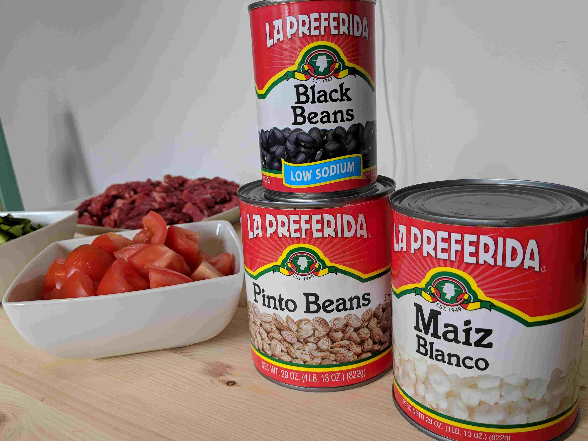
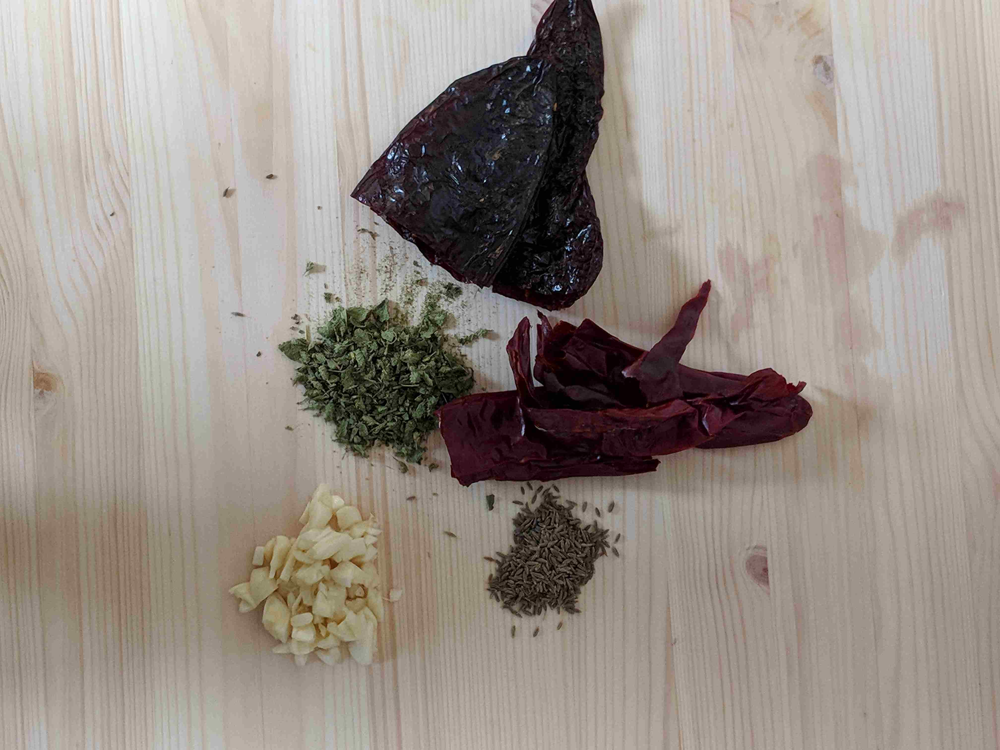

Chili. 'Nuff said hi.

---

Start by prepping the ingredients. Here's some of what I used.

Bean choice is really up to you, this is what we had, so that's what 
we used! Same goes for the chiles, here I used guajillo and ancho. 

It's chili so just get everything into
chunks. The size is really up to you. Dice the tomatoes
small enough so they can be blended, and make the peppers bite sized. 

Same goes for the meat

Once you're prepped, add a bit of oil to a pot

and sear the meat over medium high heat. While searing, steep the chiles
in hot water. 

Once soft, add the tomatoes, onions, garlic and chiles to a blender. 

Pulse until liquid!

And add to the meat

Now you can add the oregano and pepper, and let simmer

Let this simmer a few hours until the meat is softened to your liking. Then you
can add the beans and hominy, like so:

Let this simmer for about 30 minutes or so and you're done! Serve in a bowl with
sour cream or yogurt and green onion. 

